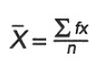
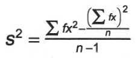
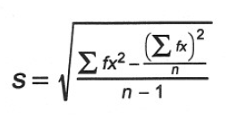

- [COP 4813/COP 5819: Internet Programming](#cop-4813-cop-5819--internet-programming)
  * [Assignment 1](#assignment-1)
    + [Delivery Instructions](#delivery-instructions)
    + [Folder Structure](#folder-structure)
      - [Assignment Description](#assignment-description)
      - [Part 1](#part-1)
      - [Part 2](#part-2)
      - [Part 3](#part-3)
      - [Grading Rubric](#grading-rubric)
- [COP 4813/COP 5819: Internet Programming](#cop-4813-cop-5819--internet-programming-1)
  * [Assignment 2](#assignment-2)
    + [Delivery Instructions](#delivery-instructions-1)
    + [Folder Structure](#folder-structure-1)
      - [Assignment Description](#assignment-description-1)
      - [Part 1](#part-1-1)
      - [Part 2](#part-2-1)
      - [Part 3](#part-3-1)
      - [Grading Rubric](#grading-rubric-1)
- [COP 4813/COP 5819: Internet Programming](#cop-4813-cop-5819--internet-programming-2)
  * [Assignment 3](#assignment-3)
    + [Delivery Instructions](#delivery-instructions-2)
    + [Folder Structure](#folder-structure-2)
    + [Assignment Description](#assignment-description-2)
    + [Part 1](#part-1-2)
    + [Part 2](#part-2-2)
    + [Part 3](#part-3-2)
    + [Grading Rubric](#grading-rubric-2)

<small><i><a href='http://ecotrust-canada.github.io/markdown-toc/'>Table of contents generated with markdown-toc</a></i></small>

# COP 4813/COP 5819: Internet Programming
## Assignment 1
                                                   
### Delivery Instructions
After completing the assignment, you are to submit a file containing a link to the assignment on the server. Additionally, the file should contain links to any resources (backgrounds, images, graphics, etc) you found on the Internet that were used in this assignment.
 
### Folder Structure
1. **http://server /~Nnumber/cop4813/index.html** - Initial ePortfolio web page will be used to link to subsequent assignments.
2. **http:// server /~N number/cop4813/assign1 /index.html** - The location for assignment 1 – the “About Me” web page.
3. **http:// server /~Nnumber/cop4813/ style.css** - The location for the style sheet for your ePortfolio.
 
#### Assignment Description
This is your first web page creation assignment for the course.  It is critical that you understand how to configure your web account, create folders, and properly upload files to the server. You are required to complete this assignment **without** the assistance of an authoring tool (e.g., DreamWeaver or NVU) as these skills are essential for the mastery of subsequent assignments.
 
#### Part 1
In this assignment, you will be creating the structure for the location of the following assignments and folder structure. You are first going to create a folder named cop4819 in your username folder. In the cop4819 folder, you will place an html file named index.html.  This web page will be an ePortfolio that provides links, brief descriptions, and reflections to all the assignments that you will do in this course.  An ePortfolio is a reflective device for you to watch your skills develop over time and for you to showcase to other interested parties.  The index.html file in the cop4819 folder should have the following information:
 
1. The title of the web page should be “COP 4813 OR COP 5819: Internet Programming”.
2. The web page should have a heading (H1) with “ePortfolio for COP 4813 OR COP 5819: Internet Programming” as the title and a smaller heading with your name centered on the page.
3. The information should be structured using a Table. Alternatively, you are welcome to use CSS to structure the information on the page. Regardless, the page should have a professional look-and-feel.
4. After the heading information, you should place a horizontal rule to separate the heading information from the first paragraph. 
5. The first paragraph heading should be titled “Assignment 1”, which should be an active link to the assign1/index.html web page using a relative path (About Me).
6. Using the paragraph tag and a combination of text formatting tags, place a couple paragraphs directly under “Assignment 1” heading that provides a description of the first assignment and a reflection about what you learned.  You should use your words to describe this assignment – not mine. 
7. Place an unordered list under the paragraphs that lists the learning objective of this assignment as you interpret them. Keep in mind, you will have to do this for each assignment in the course upon completion and submission.
8. Place another horizontal rule after the paragraph.  This web page will be used to link to all the subsequent assignments in the course.
 
#### Part 2
Now that you have completed the first part of the assignment, we can move on to the next.  You are to create an “About Me” web page for your first assignment in the cop4813/assign1 folder.  This about me page should contain the following information:
 
1. Your full name.
2. An active link to your email account using mailto.
3. The information should be structured using a Table or be structured using CSS. The page must have a professional look-and-feel.
4. Three to four descriptive paragraphs about your past, present, and future. Provide things that you are willing to share online, such as your academic and professional aspirations.
5. An image of yourself that is properly aligned with the text (text should not touch the image) in a web compatible format (i.e., jpg). If you do not have a digital image of yourself, I suggest finding a friend with a camera phone, a digital camera, or a scanner for you to use.
6. An unordered list of your favorite web sites (minimum of 3) as active links (absolute paths). The links should open in new tabs/windows.
7. The use of the font tag to change the color of some portion of the text on the page. This tag has been deprecated. I know this. Use it anyway, I am trying to make a point.
8. Your schedule of courses for this semester, including the meeting times (or online), course title, and course prefix/number in a Table format.
9. An active link back to the ePortfolio web page created as the first part of the assignment.
 
The “About Me” me web page should be properly formatted and should not contain any information or images that are disrespectful or that you would not want to share with everyone. 
 
#### Part 3
In the first and second part of the assignment, you created static web pages using a variety of html tags. Now, you are going to create a style sheet to standardize the look and feel of your ePortfolio. The cascading style sheet will modify each of the elements in your ePortfolio so there is a consistent format.  Follow the instructions to create and integrate your cascading style sheet:
 
1. Create a separate cascading style sheet file (.css) file extension for all changes to the ePortfolio.
2. Link your ePortfolio pages to the cascading style sheet (external).
3. Create a rollover effect for the active links in your ePortfolio.  The rollover effect should change the color and appearance of the text link when hovered over.
4. Standardize the paragraph tag so that it has a consistent font-family and color.
5. Standardize the heading tags (all of them) to have the same font.
6. Standardize the body tag to a consistent margin.
7. Standardize the horizontal rule to have a consistent color
8. Standardize the background image (repeating background image) on all pages that does not interfere with the text. I suggest using the background color of the table to overlap the background images of the body.
9. Standardize the unordered list tag to the same list style image, and position.
 
You are welcome to go above and beyond the expectations set in this assignment.  Be sure to, at minimum, meet the expectations set in the specifications.
 
#### Grading Rubric
This assignment will be evaluated using a 100 point scale.  Each of the specifications will be worth a varying number of points.  If you do not understand any of the specifications, post immediately to the discussion board on Canvas.  As long as you meet all the specifications, you should receive full credit.  Late assignments will not be accepted.

# COP 4813/COP 5819: Internet Programming
## Assignment 2
 
### Delivery Instructions
After completing the assignment, you are to submit a file containing a link to the assignment on the server. Additionally, the file should contain links to any resources (backgrounds, images, graphics, etc) that you found on the Internet that were used in this assignment.
 
### Folder Structure
1. **http://server /~Nnumber/cop4813/index.html** - Update ePortfolio page with your assignment description, reflection and learning objectives.
2. **http:// server /~Nnumber/cop4813/assign2/index.html** - The location for assignment 2.
 
#### Assignment Description
In your second assignment, we are going to focus on decision control structures and web form elements. You are going to have to create a site that collects some information from a user, uses this information to make decisions, and provide the user with custom feedback based on the information that they provided. You are not allowed to use any software libraries/frameworks on this assignment (e.g., jQuery). You will be able to use libraries starting on the next assignment.
 
#### Part 1
First, you will need to create a form using various HTML tags. The form should collect relevant information from the users. The type of information you collect is entirely up to you.  However, your page must minimally include:
 
1. Textboxes to collect free form information.
2. Radio buttons to collect one option among many.
3. Check boxes to collect many options among many.
4. Drop down boxes to select one option from many.
5. A reset button option.
6. A submit button option that will call an event (See Part 2).
 
These form elements must be organized meaningfully on the page and be properly labeled. Also, provide clear instructions to the user on how to complete the form and the form’s purpose. The page must link to your style sheet from the previous assignment. Feel free to update the style sheet as you see fit.
 
#### Part 2
Now that you have created a form to collect information from the user, you have to implement a program to use the information for a pre-defined purpose. Before starting this process, sit down and write down the inputs, outputs and processes that are going to be used in the program. You might try implementing the flow chart (see Part 3) before implementing the code of your program. There are minimal technical requirements, which include:
 
1. Create a function within the HTML page in the header that will be triggered by the user clicking a button.
2. The function must determine whether the user provided appropriate information. For example, you might check that the user provided a name or select at least one option from a list of many options.
3. If the data is valid, continue processing the information in some way. If the data is invalid, send the user a message indicating what needs to be fixed (Note: Try not to use alert boxes. They annoy users).
4. Assuming the data is valid, use a combination of if-then-else control and switch structures to make a decision using the data the user provides.
5. Based on the processing of the information, present the results of the processing on the screen for the user. You could present the information in many ways, such as using document.write or a text area.
 
You do not have to use every piece of information you collect in the decision-making process. Your goal is to write concise decision control structures using sound logic to make a decision. If you see that you are asking the same questions multiple times, you are probably not forming your logic appropriately.
 
#### Part 3
You must create structured flow chart using Visio 2010(16) or some related software. The flowchart must use the appropriate symbols to illustrate the decision structure of your program. The structured flow chart must trace your program exactly as it is implemented. After creating the flowchart, save it as an image file for the web (e.g., gif). Either link the flowchart from the assignment page or embed the image in a good location within the page.
 
#### Grading Rubric
This assignment will be evaluated using a 100 point scale.  Each of the specifications will be worth a varying number of points.  If you do not understand any of the specifications, post immediately to the discussion board on Canvas.  As long as you meet all the specifications, you should receive full credit.  Late assignments will not be accepted.

# COP 4813/COP 5819: Internet Programming
## Assignment 3
 
### Delivery Instructions
After completing the assignment, you are to submit a file containing a link to the assignment on the server. Additionally, the file should contain links to any resources (backgrounds, images, graphics, etc) that you found on the Internet that were used in this assignment.
 
### Folder Structure
1. **http://server /~Nnumber/cop4813/index.html** - Update ePortfolio page with your assignment description, reflection and learning objectives.
2. **http:// server /~Nnumber/cop4813/assign3/index.html** - The location for assignment 3.
 
### Assignment Description
In your third assignment, we are going to focus on repetition control structures and arrays as a data structure. You are going to have to create a program that computes several different descriptive statistics based on the information that the user provides.
                                                                                                                      
### Part 1
First, you will need to create a form using various HTML tags. The form should collect a list of numbers from a user. I suggest simply using a text area in which the user can simply copy and paste a list of numbers. Or, you can collect the data through a list box. You can assume that the user will provide numeric data, and thus, no validation is necessary. You may use sfotware libraries starting with this assignment. I encourage you to learn at least one in this course (e.g., jQuery, AngularJS, etc.).
 
The form should provide locations to output the information that is calculated by the program. Specifically, the program should provide an output for the mean, median, count, summation, mode, variance and standard deviation of the list of numbers. The all of the outputs should be rounded to two decimal places (See Part 2).
 
Implement a function in the header of the HTML file that will, when invoked, capture the list of numbers provided by the user, parse the numbers, and populate an array of numbers based on the list that is provided. This array will then serve as input to several functions (See Part 2). This function should also, after invoking the functions below, present the information.
 
The form elements must be organized meaningfully on the page and be properly labeled. Also, provide clear instructions to the user on how to use the form and the form’s purpose. The page must link to your style sheet from the previous assignment. Feel free to update the style sheet as you see fit.
### Part 2
Now that you have created a form to collect a list of numbers, you have to implement a program to use the information. You need to create a JavaScript file to serve as a function library. Name the file Statistics.js, and within the file, provide functions for the following statistical procedures. Your assignment HTML file must link to the function library.

**N (number) – findN(array)**
 
The N is the number of values within a list of numbers.

**Summation – findSum(array)**\

**Mean -  findMean(array)**

**Median - findMedian(array)**

The median is the middle value (odd list of numbers) or the mid-point of the middle two (event list of numbers) in a sorted list of numbers.

**Mode - findMode(array)**

The mode is the value that occurs the most frequently in a list of numbers. Please note this is by far the most challenging procedure you will implement. Your code should account for a multimode condition.

**Variance of sample - findVariance(array)**

 
**Standard deviation of sample – findStandardDeviation(array)**

Notice that there are patterns in these equations. Some aspects of these equations are derived from other equations. Your functions should make use of these patterns by having one function call another function to do intermediate processing. This reduces the amount of code you are writing and allows you to reuse the code you are writing. Remember, goals of software development include both modularity and reusability. These are two key concepts embedded within this programming assignment.
 
### Part 3
After having completed your program, you need to conduct unit testing for each of the functions you have written. To do this, you should include three sets of data and apply each set of data to your program. Compare the results of what your program produces as output with the results of either a hand calculation or the results from a spreadsheet. Save this information in an HTML format (table) and provide a link to the test results on the assignment page. 
 
### Grading Rubric
This assignment will be evaluated using a 100 point scale.  Each of the specifications will be worth a varying number of points.  If you do not understand any of the specifications, post immediately to the discussion board on Canvas, and seek help from me.  As long as you meet all the specifications, you should receive full credit.  Late assignments will not be accepted.
